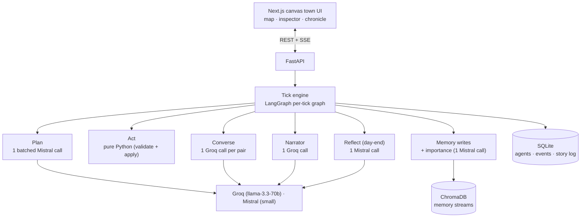

# 👻 Ghost Town

A simulated village of **8 LLM agents** with jobs, memories, relationships, and
goals. They wake up, work, gossip, form opinions, and react to events you inject
("a stranger arrives asking about the old mine"). You watch it on a hand-drawn
canvas map — click a resident to read their mind, click a speech bubble to read
the conversation, and fast-forward days to watch stories *emerge* rather than be
scripted.

The headline trick: **a secret told to one villager reaches others by
mechanically propagating through memory** — gossip is real, not prompted. And it
all runs inside **free LLM tiers** thanks to aggressive batching (~2–4 calls per
tick, ~17 per simulated day).

> Inspired by Stanford's *Generative Agents* (Park et al. 2023), rebuilt for a
> zero-budget stack and a tighter token diet.

---

## The map

A raw `<canvas>` game renderer (no game engine): pixel-art cottages, cobble
paths, a fountain plaza. The eight residents are identifiable by occupation
(baker's toque, blacksmith's apron + hammer, well-keeper's headscarf…), **walk
along the paths** between places each tick, gather in the square by evening, and
whisper 🤫 when a secret passes. The whole scene is lit by the simulation clock —
soft dawn, bright noon, and a dusk where windows glow and fireflies drift.

---

## Architecture



**Non-negotiable design rule — LLM-proposes / code-disposes.** World state lives
in the DB and is mutated *only* by validated Python. The LLM returns proposals;
Python validates and applies or rejects them. This keeps the sim coherent and
cheap.

**Tick phases** run in strict order as a LangGraph graph:
`plan → act → converse → remember → narrate` (+ a day-end `reflect`).

Repo layout: `sim/` (the engine — pure, headless, testable), `api/` (FastAPI +
SSE), `web/` (Next.js + canvas renderer). The whole simulation runs headless via
`python -m sim.cli` before any UI is involved.

---

## The token-budget trick (the core engineering story)

The naïve design is one LLM call per agent, per phase, per tick:
`8 agents × ~3 phases × ~20 ticks/day ≈ 500 calls/day`. Free tiers die instantly.

**Batched-mind planning:** *one* planning call handles **all eight agents** per
tick. The prompt has a strict per-agent section (compressed persona + current
goal + top-3 retrieved memories + what they can see), and JSON-mode output
returns every agent's `{destination, action, reason}` keyed by id. Conversations
stay per-pair (dialogue quality needs it), the narrator is one call, and
reflection is one call at day-end.

Per tick: `plan (1) + up to 3 dialogues + importance scoring (1) + narrator (1)`
≈ **2–6 calls**. A full simulated day (3 ticks + a reflection) measured at
**~17 calls** — comfortably inside Groq + Mistral free tiers, and split across
two providers for 2× headroom. A hard per-day budget counter degrades to a
**"quiet tick"** (agents continue their activity, no calls) if it's ever
exceeded.

**The trade-off, acknowledged:** batching risks cross-agent *bleed* — an agent
"knowing" another's private plan or secret because they shared one prompt.
Mitigations: strict prompt sectioning + an **anti-bleed validator** that rejects
any plan whose reason references information absent from that agent's own memory
(rejected agents fall back to a safe action). Two providers also mean automatic
**fallback** (groq ↔ mistral) with fast-fail on rate limits.

---

## Memory system

Each agent has a **memory stream** in a per-agent ChromaDB collection. Every
entry is `{text, type: observation|conversation|reflection, importance 1–10,
tick}`.

- **Retrieval** (the Stanford recipe, simplified) scores each memory by
  `α·relevance + β·recency + γ·importance` (`α=1.0, β=0.8, γ=0.6`; relevance =
  cosine similarity, recency = exponential decay over ticks, importance
  normalized). Top-3 feed planning, top-5 feed conversations.
- **Importance** is LLM-scored at write time — but *batched*: one Mistral call
  scores all of a tick's new memories at once.
- **Reflections** at day-end: each agent distills the day's high-importance
  memories into 2–3 belief statements ("I don't trust the merchant"), stored as
  high-importance memories themselves. This is what makes agents *change* over
  days.
- **Relationships**: a numeric sentiment (−1..+1) + one-line summary per known
  agent, updated after each conversation — drives visible seek/avoid behavior.

> **Information = memory.** An agent knows a fact *only* if it's in their stream.
> Nothing leaks into a prompt beyond what that agent could actually know.

---

## Gossip mechanics (the demo centerpiece)

1. A cheap Python heuristic decides *who* talks: co-located pairs ranked by
   sociability + |relationship sentiment| (rivals argue too) + acquaintance,
   minus a **cooldown** so a pair that just talked yields to fresh listeners —
   gossip keeps reaching new ears instead of looping.
2. One Groq call generates the whole 2–4 exchange dialogue, conditioned on both
   personas, mutual relationship summaries, and each one's retrieved memories.
3. The same call returns **"information transferred"** per direction. Each item
   is **grounded** (a speaker can't pass on a secret they don't know) and
   **deduped** (you don't re-learn what you already know), then written into the
   *learner's* stream from their perspective: *"Tilda told me the merchant is
   secretly bankrupt."*

Because information only exists as memory, writing those transfers **is** the
propagation. Run it: `python -m sim.gossip_demo` — it injects a distinctive
secret into one villager, runs the town live, and prints the propagation chain
with the exact (often mutated) wording at each hop, asserting it reached ≥2
others.

---

## What I simplified vs. the Stanford paper, and why

| Stanford *Generative Agents* | Ghost Town | Why |
|---|---|---|
| ~1 LLM call per agent per step | **1 batched call for all agents** per plan step | Free tiers. This is the whole point — 10× fewer calls, at the cost of a bleed risk I guard with validation. |
| Rich reflection trees, recursive syntheses | **2–3 flat belief statements** at day-end | Depth vs. budget. Flat reflections still change behavior over days; trees would multiply calls. |
| Full-graph pathfinding on a tile world | **Zone teleport + walk-tween** along a path graph | The story is social, not spatial. Movement is cosmetic. |
| Continuous, fine-grained clock | **3 ticks/day** (morning/afternoon/evening) | Fewer decision points = fewer calls, still enough for day-arcs. |
| Learned/importance-weighted everything | **Hand-tuned α/β/γ + heuristic pairing** | Legible, debuggable, and free; the constants live in `sim/config.py`. |
| Persistent vector memory | **Ephemeral in v1** | The chroma persistent client has a Windows disk-flush (HNSW) bug; save/load is P1. |

The honest interview version: *batching is a 10× cost win that trades away
per-agent isolation, so the interesting engineering is the validation layer that
buys the isolation back.*

---

## Run it

```bash
# 1. Python 3.11 engine (headless)
py -3.11 -m venv .venv && .venv\Scripts\python -m pip install -r requirements.txt
.venv\Scripts\python -m sim.cli --ticks 6                 # ASCII map + tick report
.venv\Scripts\python -m sim.gossip_demo                   # watch a secret spread
.venv\Scripts\python -m sim.day_run 2 "a stranger arrives at the square asking about the old mine"
.venv\Scripts\python -m pytest sim/tests -q               # 36 tests

# 2. The town in your browser
.venv\Scripts\python -m uvicorn api.main:app --port 8000  # backend
cd web && npm install && npm run dev                      # → http://localhost:3000
```

Set `GROQ_API_KEY` and `MISTRAL_API_KEY` (see `.env.example`). Deploy notes in
[`DEPLOY.md`](DEPLOY.md); a demo shot-list in [`DEMO.md`](DEMO.md); full spec in
[`docs/PRD.md`](docs/PRD.md).

## Stack
Python 3.11 · LangGraph · ChromaDB · Groq (llama-3.3-70b) · Mistral
(mistral-small) · FastAPI + SSE · Next.js 14 + Tailwind + `<canvas>`. All free
tier. MIT licensed.
