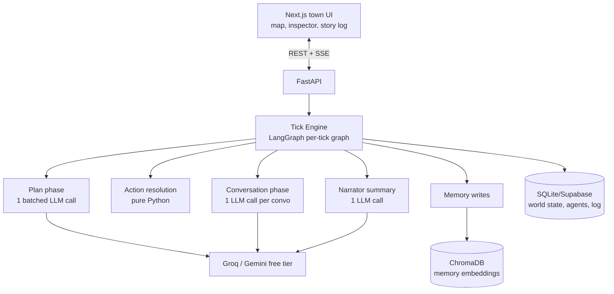

# Ghost Town — PRD & Architecture

**Author:** Aditi Kala · **Timeline:** 1 week · **Budget:** ₹0 (free tiers only)

---

## 1. Overview

Ghost Town is a small simulated town of 8–10 LLM agents, each with a job, personality, goals, relationships, and persistent memory. They wake up, work, gossip, form opinions about each other, and react to events the user injects ("a stranger arrives," "the well runs dry"). The user watches the town on a 2D map, clicks any agent to read their thoughts and memories, and can fast-forward days to watch relationships and stories *emerge* rather than being scripted.

**Why it works:** Emergent-behavior demos are inherently viral (Stanford's Generative Agents proved the genre), and under the fun surface this is the hardest architecture of the three ideas: memory systems, agent scheduling, believability under tight token budgets. Built free-tier means aggressive engineering, which is the story you tell in interviews.

## 2. Goals & Non-Goals

**Goals**
- 8–10 distinct agents living on a tile map with day/night cycles (morning/afternoon/evening ticks).
- Persistent memory per agent: observations, conversations, reflections — surviving across simulated days.
- Agent-to-agent conversations when co-located, with information *actually propagating* (A tells B a secret; B may tell C — gossip is the emergent-behavior proof).
- User event injection that visibly ripples through the town.
- Inspector panel: click an agent → current plan, recent memories, relationship scores.
- Runs a full simulated day within free-tier LLM limits.

**Non-Goals (v1)**
- Real-time continuous simulation (tick-based, user-paced).
- Pathfinding realism / animation polish (teleport-between-zones with simple tweens is fine).
- Voice, images, or agent sprites beyond simple avatars.
- Multiplayer or user-as-character mode (P1 has a "talk to an agent" feature instead).

## 3. Target Users

1. **Demo audience** (LinkedIn/Twitter/recruiters) — watch a 2-min clip of gossip spreading.
2. **You** — the point is the architecture; every subsystem is an interview story.
3. **Tinkerers** — the repo doubles as a readable reference implementation of generative agents on free tiers.

## 4. Core User Flow

1. User opens the town → sees the map (8 zones: homes, café, market, farm, well, square) with 8 agents going about their morning.
2. Presses **Next Tick** (or auto-play) → agents plan/move/act/converse; speech bubbles pop where conversations happen.
3. Clicks the baker → inspector shows her current goal, last 5 memories, what she thinks of the blacksmith (score + one-line summary).
4. Injects an event from a dropdown or free text: "a stranger arrives at the square asking about the old mine."
5. Over the next ticks, watches who meets the stranger, who hears about it second-hand, and how versions of the rumor mutate.
6. **Story log** panel keeps a readable narrated timeline; exportable as "The Chronicle of Day 3."

## 5. Feature Requirements

### P0 (must ship)
| ID | Feature | Notes |
|----|---------|-------|
| F1 | Town map + agent positions | Simple 2D zone map (SVG/canvas); agents as avatars with name labels |
| F2 | Tick engine | One tick = one time-slot; resolves all agents' plans → actions → interactions |
| F3 | Agent minds | Persona sheet + planning call per tick (where to go, what to do, with a one-line reason) |
| F4 | Memory system | Memory stream per agent with importance scoring, recency decay, retrieval-on-demand |
| F5 | Conversations | Co-located agents may converse (2–4 exchanges); both store summarized memories of it |
| F6 | Reflections | End of simulated day: each agent distills memories into higher-level beliefs ("I don't trust the merchant") |
| F7 | Event injection | User text becomes a world event observable by agents in the target zone |
| F8 | Inspector panel | Plan, memories, relationships per agent |
| F9 | Story log | Narrator LLM summarizes each tick into 2–3 sentences of readable prose |

### P1 (stretch)
- Talk-to-an-agent chat (user interviews a resident; answers grounded in that agent's memories only).
- Relationship graph visualization (nodes = agents, edge weight = sentiment).
- Save/load town state; shareable "chronicle" pages.
- Rumor-mutation tracker showing how a fact distorted hop by hop.

## 6. Architecture

### 6.1 System overview



### 6.2 The token-budget trick (the core engineering story)

Naive design = 1 LLM call per agent per tick per phase → 8 agents × 3 phases × 20 ticks/day ≈ 500 calls/day. Free tiers die.

**Batched-mind design:** one *planning* call handles ALL agents per tick — the prompt contains each agent's compressed persona + top-3 retrieved memories + current world snapshot, and JSON-mode output returns every agent's `{destination, action, reason}` in one response. Conversations stay per-pair (they need dialogue quality), and the narrator is one call. Result: **~4–6 LLM calls per tick, ~30–60/day** — comfortably inside Groq/Gemini free tiers.

Trade-off acknowledged: batching risks cross-agent bleed (agents "knowing" others' private plans). Mitigate with strict per-agent sections in the prompt and a validation pass that rejects actions referencing unknown information. This trade-off discussion is gold in interviews.

### 6.3 Memory system (per agent)

- **Memory stream** (ChromaDB collection per agent): each entry `{text, type: observation|conversation|reflection, importance 1–10 (LLM-scored at write), tick, embedding}`.
- **Retrieval score** = `α·relevance (cosine) + β·recency (exp decay over ticks) + γ·importance` — the Stanford recipe, simplified. Retrieve top-3 for planning, top-5 for conversations.
- **Reflection** at day-end: fetch the day's high-importance memories → LLM writes 2–3 belief statements → stored as high-importance memories themselves. This is what makes agents *change* over days.
- **Relationships**: numeric sentiment (−1..+1) + one-line summary per known agent, updated after each conversation. Cheap, drives visible behavior (avoid/seek in planning prompt).

### 6.4 Conversation & gossip mechanics

- Co-location + relationship/goal heuristic decides *whether* a conversation happens (Python, no LLM).
- One LLM call generates the full 2–4 exchange dialogue for the pair, conditioned on both personas, mutual relationship summaries, and each one's top retrieved memories.
- Post-processing extracts "information transferred" items → written to *both* memory streams from each agent's perspective. This is the gossip propagation mechanism — information only exists for an agent if it's in their memory stream.

### 6.5 World state

Plain SQLite (or Supabase if you want cloud persistence) holds: agents (persona, position, goals), zones, tick number, event queue, story log. The world is authoritative in the DB; LLMs only ever *propose* actions that Python validates and applies.

## 7. Tech Stack (all free)

| Layer | Choice | Why |
|-------|--------|-----|
| Orchestration | **LangGraph** (per-tick graph: plan → act → converse → remember → narrate) | Deterministic phases, retries, checkpointed state |
| LLM | **Groq free tier** (Llama 3.3 70B) for dialogue speed; **Gemini flash** for batch planning/scoring | Split by strength; two free tiers = 2× headroom |
| Memory | **ChromaDB** (local, free) with default embeddings | Zero-setup vector store |
| World DB | **SQLite** (dev) → optional Supabase | Simplicity first |
| Backend | **FastAPI** + SSE for tick streaming | Familiar |
| Frontend | **Next.js + Tailwind**, SVG map (skip Phaser — a game engine is overkill for zone-teleport movement) | Ship in 2 days, not 4 |
| Hosting | Vercel (UI) + Render (API) free tiers; ChromaDB/SQLite on Render disk | ₹0 |

## 8. Data Model

```sql
agents(id, name, persona text, occupation, home_zone, position,
       daily_goals jsonb, avatar text)
relationships(agent_id, other_id, sentiment float, summary text, updated_tick)
memories -> ChromaDB collections: memories_{agent_id}
world(tick int, time_slot text, day int)
events(id, tick_injected, zone, description, source text) -- source: user|system
story_log(tick, prose text)
conversations(id, tick, zone, participants text[], transcript jsonb, transfers jsonb)
```

## 9. Week Plan

| Day | Deliverable |
|-----|-------------|
| 1 | World scaffolding: agents/zones/tick loop in pure Python with stub minds (random actions). UI-less, console-rendered map. Pin versions in CLAUDE.md |
| 2 | Batched planning call + action validation; agents move with reasons; SQLite state |
| 3 | Memory system: ChromaDB streams, importance scoring, retrieval; planning now memory-conditioned |
| 4 | Conversations + information transfer + relationships; first gossip test ("tell the baker a secret, watch it spread") |
| 5 | Reflections + event injection + narrator/story log; full simulated day end-to-end on free tier |
| 6 | Next.js UI: map, tick controls, inspector, story log, event box; deploy |
| 7 | Seed a compelling scenario (personas with built-in tensions), record the gossip-spread demo video, README with architecture + token-budget writeup, LinkedIn post |

**Persona-writing tip for Day 7:** pre-load tensions (the merchant owes the farmer money; the baker and blacksmith are rivals for the café owner's attention). Emergence demos better when the initial conditions are flammable.

## 10. Risks & Mitigations

| Risk | Mitigation |
|------|------------|
| Token budget blowout | Batched planning (see 6.2); hard per-day call budget with graceful "quiet tick" degradation |
| Agents behave incoherently / break character | Validation layer rejects impossible actions; low temperature on planning, higher on dialogue |
| Cross-agent info bleed from batching | Strict prompt sectioning + post-hoc check: does the action reference info absent from that agent's memories? |
| Boring emergent behavior | Flammable personas, scheduled system events (market day), goals that force interaction |
| ChromaDB on Render free disk resets on redeploy | Export/import memory snapshots to Supabase storage; or accept resets in v1 and document it |
| Week overruns (this is the hardest of the 3) | Day-5 checkpoint rule: if conversations aren't working by Day 5 morning, cut reflections (F6) — gossip is the demo, reflections are depth |

## 11. Success Metrics

- A secret told to one agent reaches ≥ 3 others within 2 simulated days — *with mutations visible in the story log*.
- Full simulated day ≤ 60 LLM calls, ₹0 spend.
- Inspector shows coherent, memory-grounded reasoning for any agent at any tick.
- 2-minute demo video that a non-technical person finds delightful.

## 12. Interview Talking Points

- Generative-agent memory architecture (stream, importance, retrieval, reflection) — and what you simplified vs. the Stanford paper, and why.
- The batched-mind pattern: 10× LLM-call reduction, its failure modes, and the validation layer that guards them.
- Information-as-memory design making gossip *mechanically real* rather than prompted.
- LLM-proposes / code-disposes: why the world state is authoritative in Python, not in the model.